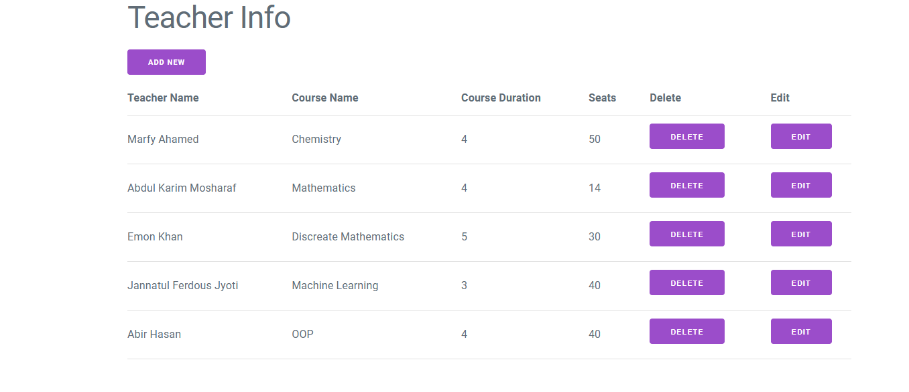
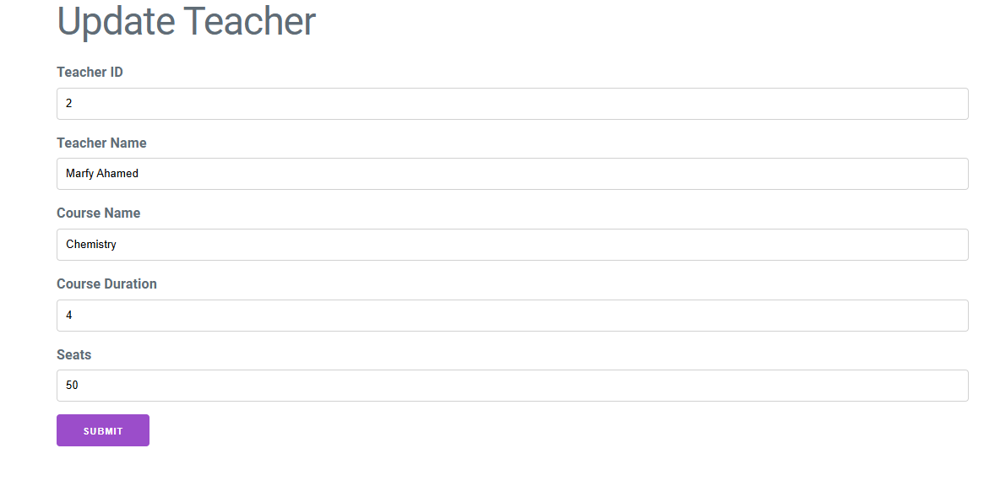
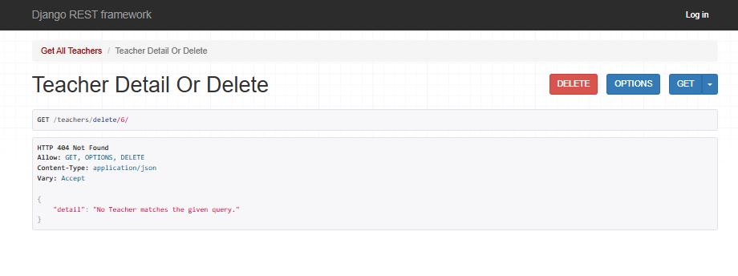
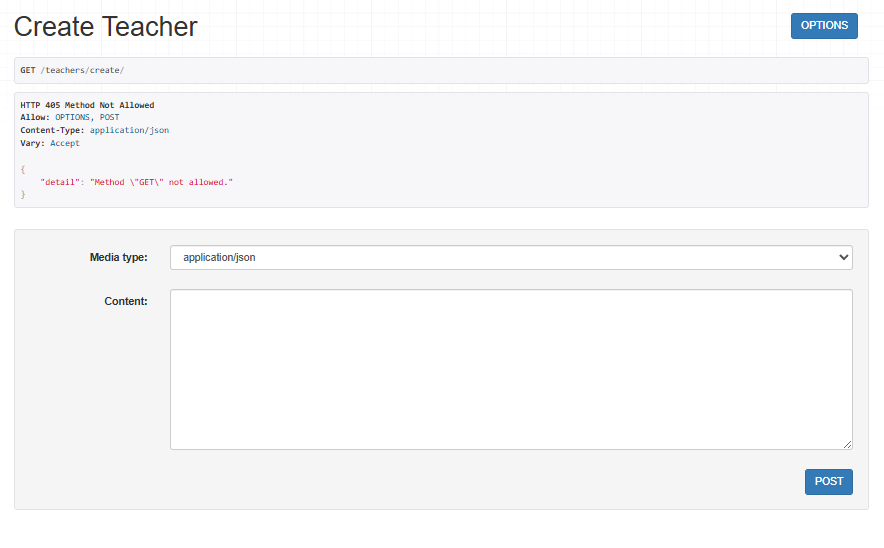
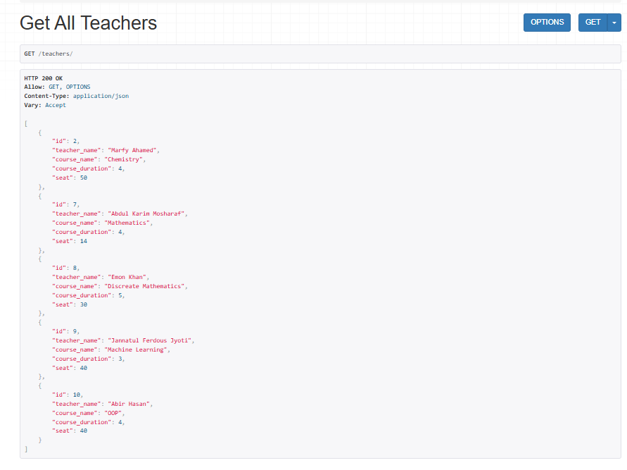

# API with Frontend


This project is a simple CRUD (Create, Read, Update, Delete) API built with Django and Django REST Framework, providing backend functionality for managing resources. It also includes a basic frontend integration, allowing users to interact with the API via a user-friendly interface.
## Features

- **CRUD Operations:** Create, list, update, and delete categories for blog posts.


## Tech Stack
- **Backend:** Django 5.1.4, Django REST Framework
- **Frontend:** HTML, CSS, Javascript
- **Database:** SQLite3

## API Endpoints
-  **Categories** 
- GET /teachers/: Fetch all teachers
- POST /teachers/create/: Create a new teacher
- GET /teachers/<int:pk>/: Fetch a teacher by ID
- PUT /teachers/update/<int:pk>/: Update a teacher by ID
- DELETE /teachers/delete/<int:pk>/: Delete a teacher by ID


## Setup Instructions

1. Clone the repository:
   ```bash
   git clone https://github.com/your-username/your-repo-name.git
   cd your-repo-name
   
2.Create a virtual environment:
python -m venv env
source env/bin/activate  # On Windows, use `env\Scripts\activate`

3.Install dependencies:
pip install -r requirements.txt

4.Set up the database:
python manage.py migrate

5.Create a superuser to access the admin panel:
python manage.py createsuperuser

6.Run the development server:
python manage.py runserver

7.Access the application at http://127.0.0.1:8000/.

8.Go to Ajax and run index.html for frontend

9.Access the application at http://127.0.0.1:5500/ajax/index.html
